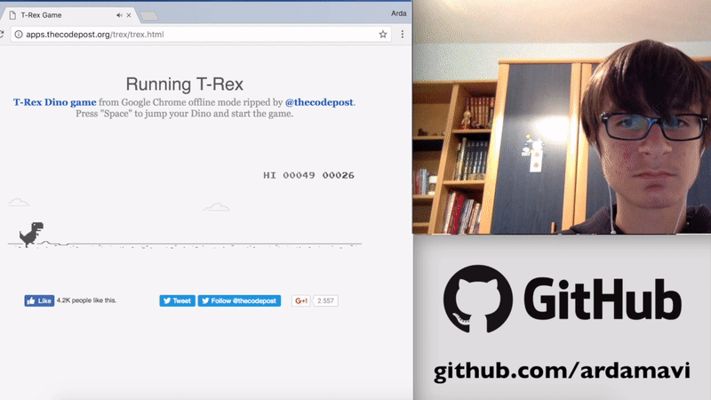

# Controller Hand
### By Arda Mavi

Control Google's dinosaur game with your hands from webcam. 
With Deep Learning.

###  Simple Demo:

### Using:
When you run `python3 camera.py` command, program will open game page and start itself.

### Model Training:
`python3 train.py`

### Creating Train Dataset:
1. Run `Python`(Python Interpreter) command in repo with Terminal.

2. Import `create_data` function from `camera.py` with `from camera import create_data` command.

3. Run `create_data(<Label>, <Size>)` 
-- Label must be 1(jump) or 0(not jump) 
-- Size: How much image you want to save. 
Note: You must add 1 and 0 database before run program.

4. Now program will take your photos and save into `Data/Train_Data/<Label>` folder.

5. Optional: If you want to convert photos to numpy file run this command: `from get_dataset import get_dataset; get_dataset()`

### Using TensorBoard:
`tensorboard --logdir=Data/Checkpoints/logs`

### Model Architecture:
- Input Data
Shape: 150x150x3

- Convolutional Layer
64 filter
Filter shape: 3x3
Strides: 1x1

- Activation
Function: ReLu

- Convolutional Layer
64 filter
Filter shape: 3x3
Strides: 1x1

- Activation
Function: ReLu

- Max Pooling
Pool shape: 2x2
Strides: 2x2

- Convolutional Layer
128 filter
Filter shape: 3x3
Strides: 1x1

- Activation
Function: ReLu

- Max Pooling
Pool shape: 2x2
Strides: 2x2

- Flatten

- Dense
Size: 128

- Activation
Function: ReLu

- Dropout
Rate: 0.5

- Dense
Size: 2

- Activation
Function: Sigmoid

##### Optimizer: Adadelta
##### Loss: Binary Crossentropy

### Important Notes:
- Used Python Version: 3.6.0

- Install `OpenCV` for Python.

- Install necessary modules with `sudo pip3 install -r requirements.txt` command.
